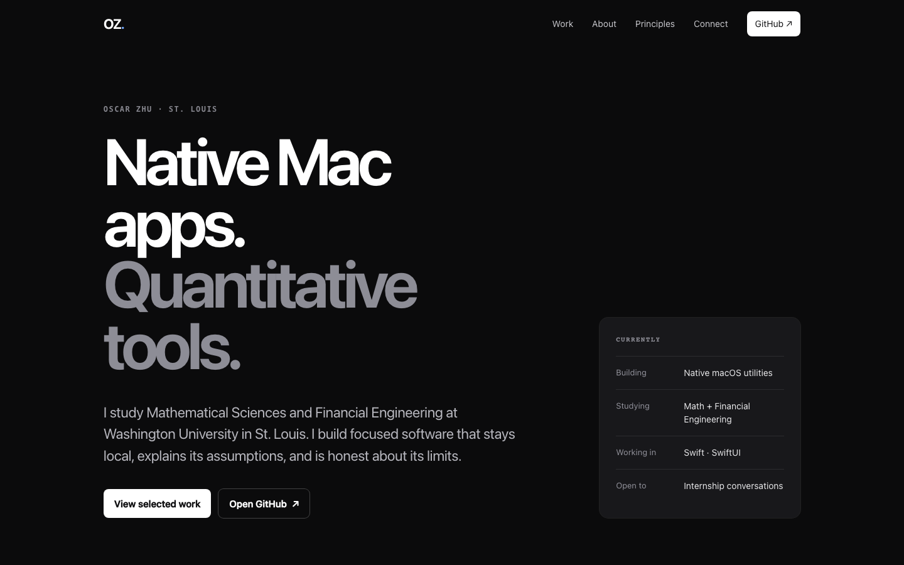

[](README.md) [](README.zh-CN.md)

# Oscar Zhu — portfolio

Source for [zhuhroscar-tech.github.io](https://zhuhroscar-tech.github.io/), a static portfolio focused on verified public software. The site presents selected projects, an introduction, working principles, and public contact links.



## Local preview

You need Git, Python 3, and a browser. There is no package installation, framework build, or backend service required for local preview.

```bash
git clone https://github.com/zhuhroscar-tech/zhuhroscar-tech.github.io.git
cd zhuhroscar-tech.github.io
python3 -m http.server 8000 --bind 127.0.0.1
```

Open <http://localhost:8000>. Run the server from the repository root so relative asset links resolve correctly. Stop it with Ctrl+C. Binding to loopback keeps this development server local; it is not a production deployment server.

## Repository guide

- [`index.html`](index.html): portfolio content and page metadata.
- [`styles.css`](styles.css): layout and visual styling.
- [`script.js`](script.js): mobile navigation, current year, and reveal behavior with reduced-motion support.
- [`assets/`](assets/): project images, favicon, and social preview image.
- [`404.html`](404.html), [`robots.txt`](robots.txt), and [`sitemap.xml`](sitemap.xml): supporting web files.
- [`tests/test_site.py`](tests/test_site.py): static site contract tests.
- [`LICENSE`](LICENSE): MIT license for the repository source.

The site is plain HTML, CSS, and JavaScript. There is no separate generated output to create before previewing these files.

## Validation

```bash
python3 -m unittest discover -s tests -v
```

Tests check identity and search metadata, required sections and project links, local images and alt text, navigation targets, supporting files, selected contrast ratios, and the absence of legacy unverified experience copy. The [validation workflow](.github/workflows/validate.yml) runs these checks on pushes and pull requests.

Passing tests is not a complete visual or accessibility review. Preview changes in a browser, check narrow-screen navigation, and verify that links and images remain useful.

## Content policy

Link only to public projects and approved public profiles. Private work artifacts, internal analyses, transcripts, and application evidence do not belong in this repository. Keep claims tied to public evidence rather than adding unsupported experience or results.

The English and Simplified Chinese READMEs document the repository; they do not change the language or content of the published site.
